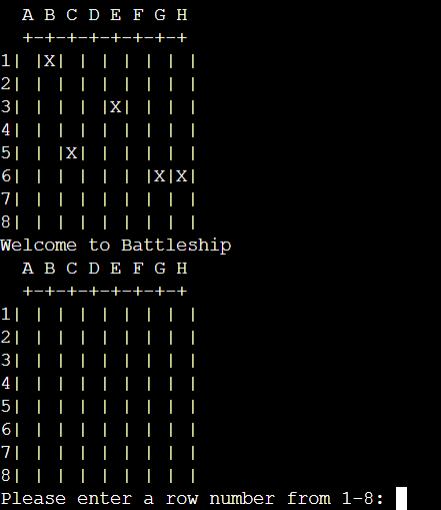

<h1 align="center">Battleship</h1>

## Description

Battleship is single player python terminal game that runs in Heroku terminal.

The user is giving 15 turns to find and destroy all five of the computer's ships. Each ship occupies one squard of the board. After 15 turns and the user doesn't destroy all the ships, the user loses and it's game over.

The battleship game is available [here](https://project-3-python-battleship.herokuapp.com)

## How to play

Battleship is based on the classic strategy type guessing game for two players. You can learn more about classic game on [Wikipedia](https://en.wikipedia.org/wiki/Battleship_(game))

In this version, it is single player game in which the computer generates five ships and randomly spaces it across the board. The user is given 15 turns to take out all the ships. 

The ship as well as a hit is represented as a 'X', while the miss is represented as a '/'.

You will lose the game if you hit 15 areas on the board and haven't destroy all the ships. 

## Features

- __Random Board__
    - The ship board is where it show the location of computer's ships. For this instance, this will displayed only once when the program runs. 
    - The guess board is the replica of the ship board where computer's ships are invisible but are still in the same place in the ship board. 

 

- __Error-checking 1__
    - Enter a letter value into number field.
    - Display an error message telling user to enter valid number.

- __Error-checking 2__
    - Enter a number value that is greater than 8.
    - Display the same error message of telling the user to enter the valid number.

- __Error-checking 3__
    - Enter a double figure number value into number field.
    - Display the error message telling the user to enter the valid number.

- __Error-checking 4__
    - Enter a letter value that isn't on the board.
    - Display the error message telling the user to enter a valid letter.

- __Error-checking 5__
    - Enter a two letter values in the letter field.
    - Display the error message, telling the user to enter a valid letter to the column.

- __Error-checking 6__
    - Selecting an area that has already been labeled as a miss.
    - An error message will be displayed, informing the user that they have aleady selected the area. 
    - This mistake wouldn't affect the user's turn. If the user has 6 turns before selecting the missed area, they will still have 6 turns left.

- __Input Validaton 1__
    - Enter any number value from 1 to 8 on the number row.
    - Enter any letter from A to H on the letter column. 
    - If the computer's ship isn't on the area that the user have selected, '/' will be displayed on that area as a miss.
    - The program will display a message, informing the user that they have miss the target.
    - A second message is printed at the same time as the first, reminding the user that they have used a turn and it is subtracted from the remaining turns. 

- __Input Validaton 2__
    - If the computer's ship is on the area that the user have selected, 'X' will be displayed on that area as a hit.
    - The first message will be printed, praising the user on hitting a ship. 
    - The second message will show the remaining turns the user has left.

- __Input Validaton 3__
    - The user selects the area where the last ship is located at, which resulted in the game ending.
    - The first message printed is the same message the user receive when they hit a ship.
    - The second and last message is printed congratulate the user for winning the game. 

- __Input Validaton 4__
    - If user has only one turn left, the game will end with a loss whether or not they hit or missed a ship.
    - One of two alternative messages will be printed, either praising the user for hitting a ship or informing the user that they have missed the target. 
    - The last message is printed, informing the user that the game is over as they have run out of turns.

 

## Data Model

I created two instance of the board that holds the computer's and guess' board. 

Each number row and columns of the board will be 8, with each value be an empty string.

As the column will be labeled in letters, I need to convert it into numbers.

Create print_board function to create a template board with '8' rows and '8' columns. Start the row number with '1' so that first row doesn't start at '0'. 

I create a function that create the computer ships on the board. The 'For' statement create five ships, and place them across the row and column from '0' to '7'. In the while loop, each ship is represented with a 'X' and they place randomly across the row and columns from '0' to '7'. 

The get_battleship_location function allow the user to start the game by selecting a row number and then column letter. If the value that the user inputed matchs row and column criteria, they both return the value. In row, the value returns as a integer minus 1. In column, the letters are coverted into numbers. 

The count_hit_battlefield function using the 'for loop' and 'if' statement to loops the rows and columns on the board to if the 'X' exist. If the 'X' does exist in area that is selected, the counter will count as 1 and return it to the counter which upgraded from this "count = 0" to "count = 1". 

The final lines of code is to print out the two boards (ship board and guess board) and write the if and else statments under while loop,so the user can run the game. Before while loop, I have enter '15' as the amount of turns the user uses. Each time is played, the amount of turn is subtract from start of the while loop. The if/else and elif statements will ensure that games run smoothly. If the user hits a target, elif statement will print the suitable message inform the user of their success and place a 'X' on the board. If the user miss, the else statement will print out a suitable and place a '/' on the board. The last two 'if' statements ends the game when the value of battleship hit on the 'GUESS_BOARD' equal to '5', or when turn counter 'turns = 15' hit '0'. Former lead to a win, while the latter lead to a loss. 

